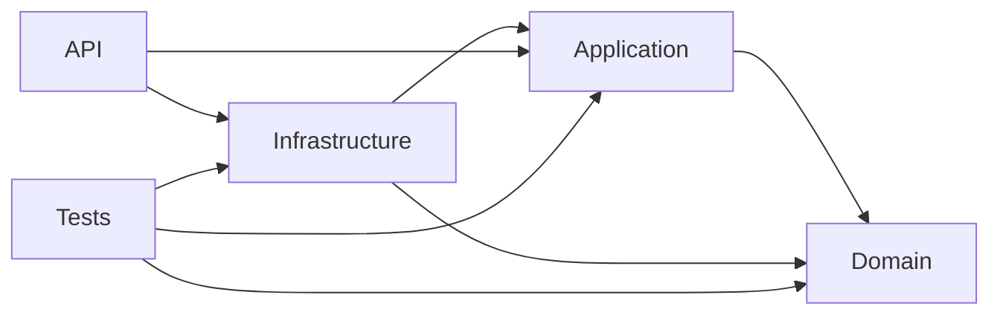

# Arquitectura en Capas

<!-- Badges / Iconos -->

API REST en .NET 8 con arquitectura en capas: `API`, `Application`, `Domain` e `Infrastructure`. Implementa operaciones CRUD para Productos, Categorías, Proveedores y Pedidos, usando Dapper para acceso a SQL Server y pruebas (unitarias e integración).

## Resumen

- Arquitectura limpia y separada por responsabilidades:
  - `API`: Controladores y configuración del host (Swagger, DI).
  - `Application`: Servicios, DTOs e interfaces de repositorio (lógica de aplicación).
  - `Domain`: Entidades del dominio (`Product`, `Category`, `Supplier`, `Order`, `OrderDetail`).
  - `Infrastructure`: Implementaciones de repositorios con Dapper y `DapperContext` para `SqlConnection`.
  - `Tests`: Pruebas unitarias e integración.

## Diagrama de referencias entre proyectos

## Base de datos: Northwind
Northwind es una base de datos de muestra que contiene datos ficticios para una tienda de productos alimenticios.
- Relación entre tablas:
  - `Products` tiene una relación de muchos a uno con `Categories` y `Suppliers`.
  - `OrderDetails` tiene una relación de muchos a uno con `Orders` y `Products`.