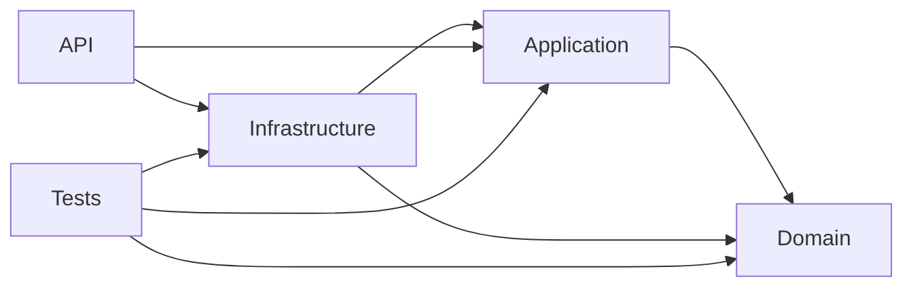

# Arquitectura en Capas

<!-- Badges / Iconos -->


API REST en .NET 8 con arquitectura en capas: `API`, `Application`, `Domain` e `Infrastructure`. Implementa operaciones CRUD para Productos, Categorías, Proveedores y Pedidos, usando Dapper para acceso a SQL Server y pruebas (unitarias e integración).

## Resumen

- Arquitectura limpia y separada por responsabilidades:
  - `API`: Controladores y configuración del host (Swagger, DI).
  - `Application`: Servicios, DTOs e interfaces de repositorio (lógica de aplicación).
  - `Domain`: Entidades del dominio (`Product`, `Category`, `Supplier`, `Order`, `OrderDetail`).
  - `Infrastructure`: Implementaciones de repositorios con Dapper y `DapperContext` para `SqlConnection`.
  - `Tests`: Pruebas unitarias e integración.

## Estructura del proyecto

- `API/` — Punto de entrada ASP.NET Core. Registra servicios en `Program.cs`.
- `Application/` — DTOs, interfaces (`IProductRepository`, `ICategoryRepository`, `ISupplierRepository`, `IOrderRepository`) y servicios (`ProductService`, `CategoryService`, `SupplierService`, `OrderService`).
- `Domain/` — Entidades del dominio.
- `Infrastructure/` — `DapperContext` y repositorios (`ProductRepository`, `CategoryRepository`, `SupplierRepository`, `OrderRepository`).
- `Tests/` — Pruebas unitarias e de integración.

Archivos clave:
- `API/Program.cs` — configuración y registro de dependencias.
- `Infrastructure/Database/DapperContext.cs` — crea `SqlConnection` usando `DefaultConnection` de la configuración.
- `Infrastructure/Repositories/*.cs` — consultas SQL con Dapper.
- `Application/Services/*` — mapeo entre entidades y DTOs, reglas de negocio (ej.: `CategoryService` evita duplicados por nombre).

## Diagrama de referencias entre proyectos

El siguiente diagrama muestra las referencias entre los proyectos de la solución. Las flechas indican "A -> B" significa "A referencia a B".



## Explicación capa por capa

- API
  Capa de presentación y entrada al sistema. Contiene controladores (p. ej. `ProductsController`), `Program.cs`, middleware y contratos HTTP. Se encarga de recibir solicitudes y delegar la lógica a la capa `Application`.

- Application
  Capa de orquestación y reglas de aplicación. Agrupa servicios (p. ej. `ProductService`), DTOs e interfaces de repositorio (`IProductRepository`). Implementa casos de uso, validaciones y mapeos; no conoce detalles de persistencia.

- Domain
  Modelo del dominio: entidades (`Product`, `Category`, `Order`, etc.) e invariantes del negocio. Aquí reside la lógica que pertenece al modelo en sí y que no depende de infraestructuras externas.

- Infrastructure
  Implementaciones técnicas y acceso a recursos externos. Contiene `DapperContext`, repositorios que implementan las interfaces definidas en `Application` (p. ej. `ProductRepository`) y la lógica de persistencia, conexiones y transacciones.

- Tests
  Conjunto de pruebas unitarias e integración. Las pruebas unitarias focan en servicios y reglas de negocio (mockeando repositorios), mientras que las pruebas de integración validan el comportamiento real contra la base de datos y las implementaciones de `Infrastructure`.

## Tecnologías

- .NET 8
- ASP.NET Core
- Dapper
- Microsoft.Data.SqlClient (SQL Server)
- xUnit (u otra, presente en `Tests`)

## Configuración

1. Configurar la cadena de conexión en `appsettings.json` o variables de entorno usando la key `DefaultConnection`.
2. Restaurar paquetes y compilar:

```bash
dotnet restore
dotnet build
```

3. Ejecutar la API:

```bash
dotnet run --project API
```

4. En desarrollo, Swagger estará disponible en `https://localhost:{port}/swagger`.

## Endpoints principales

- Productos: `GET/POST/PUT/DELETE /api/products`
- Categorías: `GET/POST/PUT/DELETE /api/categories` (creación y actualización validan nombres duplicados)
- Proveedores: `GET/POST/PUT/DELETE /api/suppliers`
- Pedidos: `GET/POST/PUT/DELETE /api/orders` (POST crea orden + detalles en transacción)

## Notas importantes

- Las consultas usan parámetros de Dapper (protección contra SQL injection si se usan correctamente). Revisar la validación de datos en los DTOs si se requiere.
- `OrderRepository` usa transacciones al crear o borrar pedidos y sus detalles.
- Añadir scripts de migración / seed para facilitar pruebas de integración.

## Ejecutar tests

```bash
dotnet test